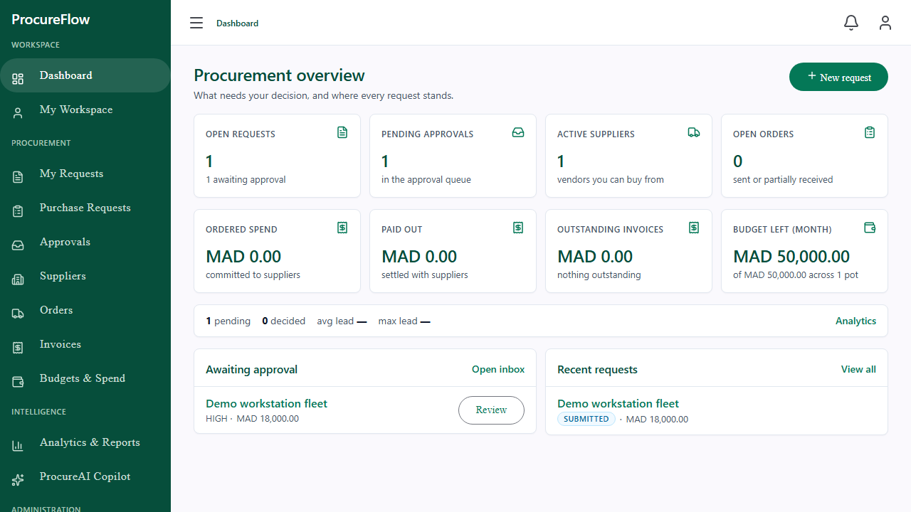
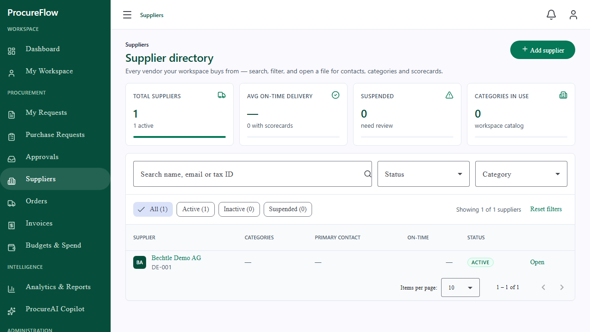
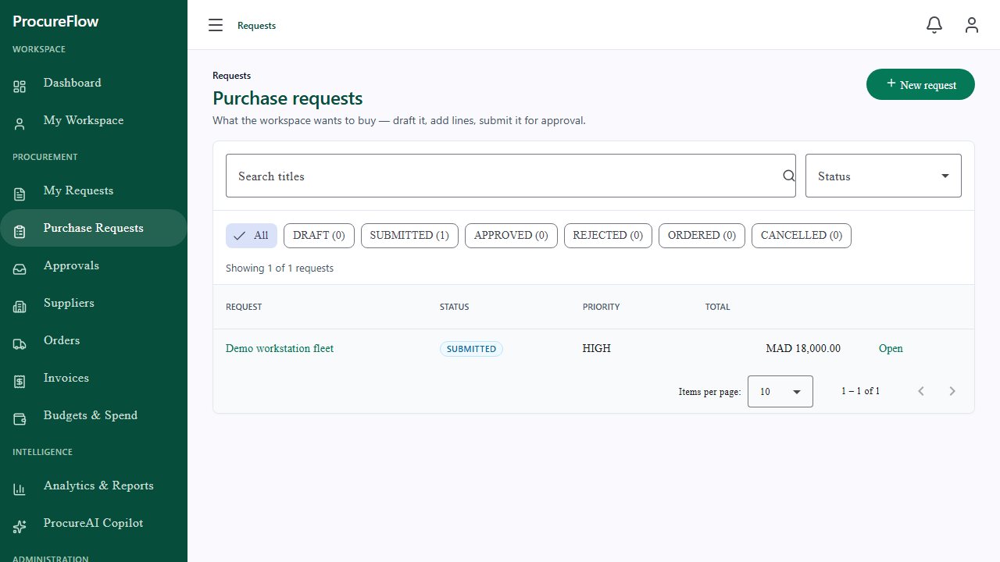
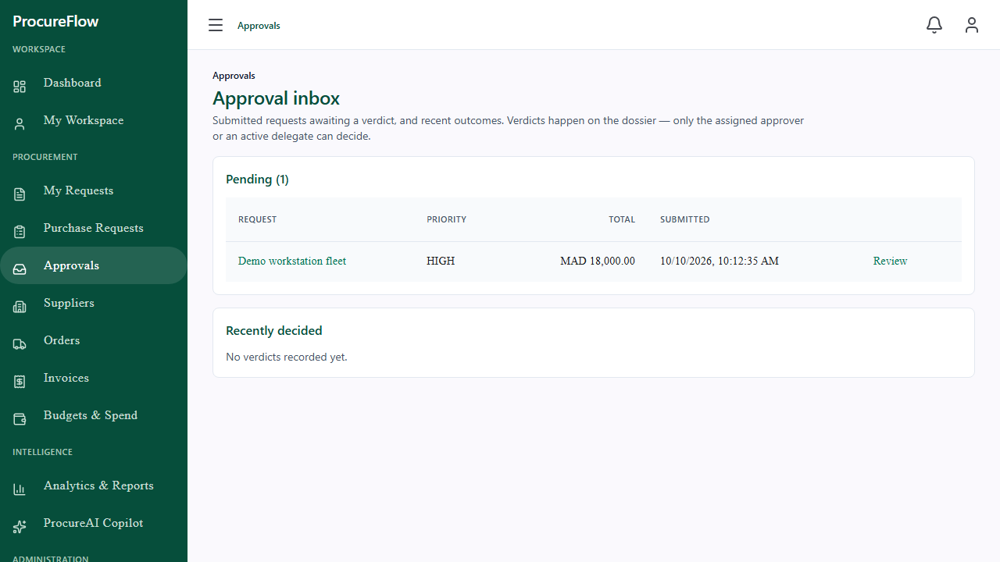
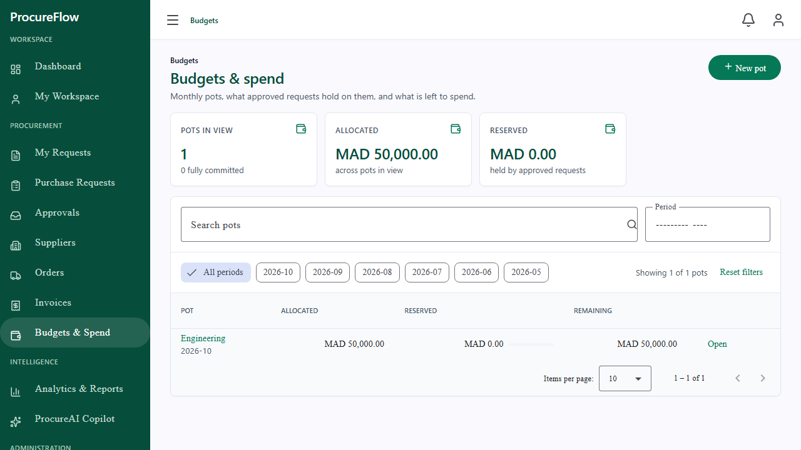
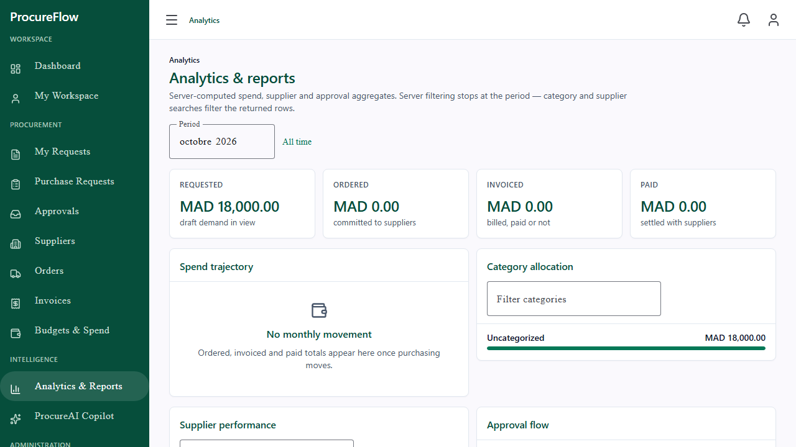
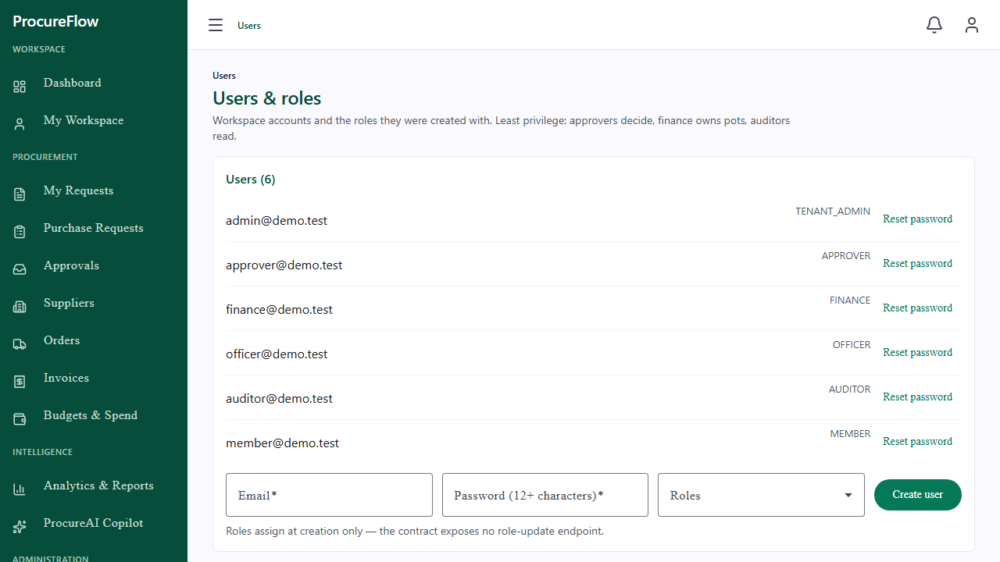
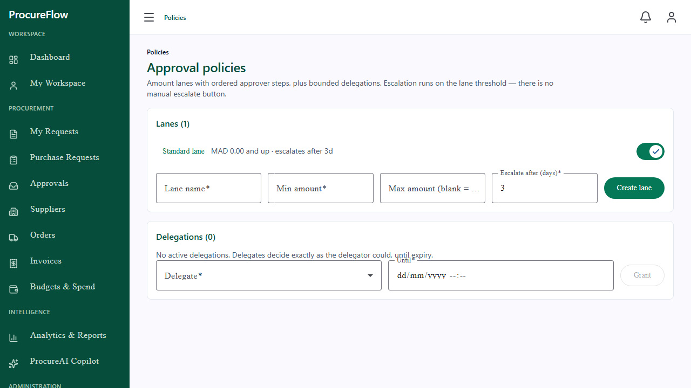
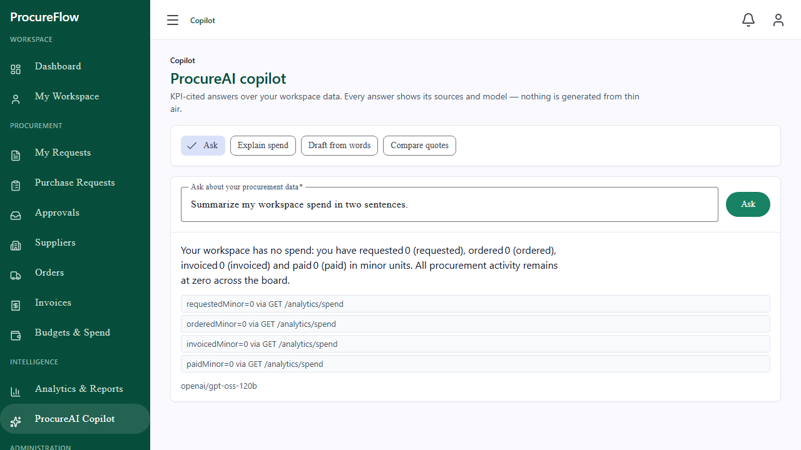

# ProcureFlow

**AI-powered multi-tenant B2B procurement and supplier management SaaS.**

ProcureFlow helps buying organizations run the full procure-to-pay flow in one
place: suppliers, purchase requests, approval workflows, budgets, purchase
orders and invoices, with an AI copilot that explains spend and drafts
requests. One backend serves many tenants; tenant data never crosses tenant
boundaries.

> Status: **working product, pre-release hardening.** The Angular frontend
> covers the page map end to end (dashboard, workspace, procurement,
> fulfillment, budgets, analytics, copilot, admin) against the real API;
> the backend carries 113 integration tests plus unit/ArchUnit gates.
> Screenshots below are all live captures. See `docs/demo.md` to click
> through it yourself, and `docs/project-management/sprint-plan.md` for
> the delivery record.

## Business problem

Mid-size companies buy through email threads and spreadsheets: approvals are
untraceable, budgets are checked after the money is spent, and supplier
performance lives in people's heads. ProcureFlow makes every step explicit,
auditable and fast: request → budget reservation → approval → order → invoice,
with AI assistance where judgment is needed.

## Target users

Six seeded roles compose the personas (see `docs/architecture/security.md`
for the permission matrix):

- **Requesters** (`MEMBER`) — raise purchase requests and track them.
- **Approvers / managers** (`APPROVER`) — decide with budget context.
- **Procurement officers** (`OFFICER`) — suppliers, orders, invoices.
- **Finance** (`FINANCE`) — budgets, invoices, spend analytics.
- **Auditors** (`AUDITOR`) — read-only trail and views.
- **Tenant admins** (`TENANT_ADMIN`) — users, departments, roles, lanes.

## Screens (live captures)

| | |
|---|---|
| Procurement overview: KPIs, financial pulse, approval flow, queue |  |
| Supplier directory with scorecards and filters |  |
| Purchase requests with lifecycle states |  |
| Approval inbox with verdicts |  |
| Budgets & spend with reservations |  |
| Analytics & reports over server aggregates |  |
| Users & roles administration |  |
| Approval lanes, steps and delegations |  |
| ProcureAI copilot with cited answers |  |

## Architecture

Modular Spring Boot monolith (Java 21) + Angular SPA, PostgreSQL, Redis,
RabbitMQ. Business domains own their code vertically
(`domain / application / infrastructure / api`); ArchUnit tests enforce the
boundaries in CI. Twelve modules: identity, organization, supplier,
procurement, approval, budget, purchaseorder, invoice, notification, audit,
analytics, ai.

- `docs/architecture/overview.md` — system context and principles
- `docs/architecture/modular-monolith.md` — module rules and dependency policy
- `docs/architecture/multi-tenancy.md` — tenant isolation strategy
- `docs/architecture/security.md` — authN/authZ design (incl. role matrix)
- `docs/decisions/` — ADRs (001 modular monolith … 009 password reset)

Key trade-offs, not slogans: a modular monolith (one deployable, strict
module boundaries) over microservices — the team is small and distributed
transactions would buy nothing; JWT body-carried tokens over HttpOnly
cookies for the first client (documented XSS-hygiene debt, refresh theft
detection included); server-computed analytics over client aggregation
(the UI never totals money it did not fetch in full); AI behind a provider
port with validated, KPI-cited outputs instead of a chat widget stapled on.

## Technology stack

| Layer | Choice |
|---|---|
| Frontend | Angular 21, TypeScript, Signals, RxJS, Reactive Forms, Vitest, Playwright |
| Backend | Java 21, Spring Boot 3.5, Security, Data JPA, Flyway, ArchUnit |
| Data | PostgreSQL 16 (Flyway V1–V13, no `ddl-auto=create` in prod), Redis 7, RabbitMQ 3 |
| AI | Groq (`openai/gpt-oss-120b`) behind an `AiProvider` port (backend only; needs `GROQ_API_KEY` + `AI_ENABLED=true`) |
| Mail | Brevo SMTP behind a `MailPort` (log-mode sink by default; needs `MAIL_*` + `MAIL_PROVIDER=smtp`) |
| Infra | Docker Compose, GitHub Actions, Prometheus + Grafana, Terraform skeleton |

## Local development

Prerequisites: JDK 21, Node 24, Docker.

```bash
cp .env.example .env   # then fill in POSTGRES_PASSWORD, JWT_SECRET (≥64 chars), ...
docker compose up -d postgres redis rabbitmq
cd backend && ./mvnw spring-boot:run -Dspring-boot.run.profiles=dev   # needs the .env vars EXPORTED in this shell
cd frontend && npm install && npm start   # http://localhost:4200
```

Notes that bite newcomers (full list in `AGENTS.md`): `./mvnw spring-boot:run`
does **not** read `.env` — export the vars first, or boot with
`SPRING_DATASOURCE_PASSWORD=… JWT_SECRET=…`; port 8080 is commonly taken
(local Apache), so the compose stack defaults the backend to `:8081` and the
`gen:api` script targets `:8081`; `spring-boot:run` serves recompiled
classes — run `compile` first when in doubt.

API docs need the backend up with docs enabled (dev profile):
`http://localhost:8081/swagger-ui.html` (dev) — disabled by default
elsewhere. Live OpenAPI at `/v3/api-docs`.

The dev profile allows the local SPA origins for CORS; production allows
nothing unless `CORS_ALLOWED_ORIGINS` is set.

## API surface

All routes live under `/api/v1/...` with a consistent problem envelope
(`docs/api/README.md` is the contract; live OpenAPI at `/v3/api-docs`).
Angular types are generated from the live contract — boot the backend on
`:8081`, then `cd frontend && npm run gen:api`, checked in at
`src/lib/api-types.gen.ts`.

| Group | Endpoints | Highlights |
|---|---|---|
| Auth | `/auth`, `/users`, `/users/me` | JWT + rotating refresh, self + helpdesk + email-link password flows, tenant provisioning |
| Organization | `/tenants/current`, `/departments`, `/memberships` | Tenant-scoped workspaces and roles |
| Suppliers | `/suppliers`, `/supplier-contacts`, `/supplier-categories` | CRUD, single-primary contacts, scorecards |
| Procurement | `/purchase-requests`, `/purchase-request-items` | Idempotent create (`Idempotency-Key`), draft lifecycle |
| Approvals | `/approvals/...` | Immutable decisions, delegations, amount lanes, escalation |
| Budgets | `/budgets` | Monthly pots, in-transaction reservation, 409 overspend |
| Orders | `/purchase-orders` | From approved requests only, snapshot lines, receipt |
| Invoices | `/invoices` | 3-way match, UNPAID → PARTIAL → PAID |
| Notifications | `/notifications` | Event-driven personal inbox |
| Audit | `/audit-events` | Append-only trail with secret redaction, admin read |
| Analytics | `/analytics/...` | Spend, supplier and approval KPIs (read-only) |
| AI copilot | `/ai/...` | KPI-cited chat, spend explanations, request extraction, quotation comparison (metered, `ai:use`) |
| Frontend | `/login`, `/register`, `/forgot-password`, `/reset-password`, `/dashboard`, `/workspace`, `/suppliers`, `/requests`, `/requests/mine`, `/approvals`, `/orders`, `/invoices`, `/budgets`, `/analytics`, `/copilot`, `/notifications`, `/settings`, `/admin`, `/admin/users`, `/admin/departments`, `/admin/workflows`, `/admin/audit` | Session shell + every workflow screen, all API-backed |

Current contract truths (the conventions doc is aspirational in places):
lists return full workspace arrays (no pagination envelope yet);
`Idempotency-Key` is enforced on creation endpoints; there is no `/api/v2`;
the envelope carries `timestamp` alongside the documented fields.

## Testing strategy

Full picture in `docs/testing/strategy.md`. Local gates (must pass before
every push):

- Backend: `cd backend && ./mvnw verify` — 113 integration tests
  (Testcontainers over real PostgreSQL 16) plus unit/ArchUnit: auth,
  tenant isolation, suppliers, procurement, approvals (incl. decision
  races), budgets (incl. reservation race), orders, invoices,
  notifications, audit, analytics, copilot, account (incl. token races),
  roles, metrics. JaCoCo floors (line 0.70 / branch 0.40) fail the build
  on regression.
- Frontend unit: `cd frontend && npm test` (Vitest, 24 tests)
- Frontend E2E: `cd frontend && npx playwright install chromium && npm run test:e2e`
  (19 tests: auth states, guarded routes, and 11 stubbed critical journeys —
  request-to-approval, unsaved-draft guard, budget, order, invoice, admin, analytics, copilot
  success/failure, notifications, settings, session expiry)
- API types: regenerate after any API change and commit the result.

## AI architecture

Angular never calls Groq. Flow: Angular → Spring Boot → `ai` module
(prompts, validation, auth, usage metering) → Groq API. The `GroqAiProvider`
is live (`openai/gpt-oss-120b`, 503 per use case while `AI_ENABLED=false`);
prompts are versioned (`Prompts.VERSION`, metered per call), outputs are
validated, and prompts carry KPI aggregates only — no user identities or
secrets. Use cases: KPI-cited chat, spend explanations, request extraction,
quotation comparison, plus a per-tenant usage endpoint. Answers render as
text with citations and model tags; the UI cancels in-flight calls and
never presents model output as verified fact.

Limits, stated plainly: no per-tenant spend caps (metering without
limiting — a heavy user burns budget); no login throttling yet (BCrypt-12
and no enumeration are the current defense); email-link reset needs SMTP
credentials or it stays in log-mode.

## Security

JWT access + rotating refresh tokens (theft revokes the chain), password
changes and resets revoke every session, RBAC with fine-grained
permissions (6 default roles), tenant isolation enforced server-side
(cross-tenant reads 404), BCrypt password hashing, HSTS + frame-deny +
nosniff headers. Secrets come from env vars only (see
`docs/security/secrets.md`). Details: `docs/architecture/security.md`,
ADR-009 (password reset).

## Observability

Actuator exposes `health`, `info` and `prometheus`; Prometheus + Grafana
configs live in `infrastructure/monitoring/` (alert rules in
`prometheus/alerts.yml`: overspend spikes, 5xx rate, AI failures/usage).
Domain counters (`procureflow.decisions`, `procureflow.budget.*`,
`procureflow.invoices*`, `procureflow.ai.calls`) ship from the services;
AI token usage is metered per tenant in `ai_usage`. Failures carry
`traceId` in the error envelope; no secrets, tokens or prompts in logs.

## CI/CD

`.github/workflows/`: `backend-ci.yml` (verify + JaCoCo artifact),
`frontend-ci.yml` (build + Vitest + Playwright on Chromium),
`security.yml` (Trivy fs scan, npm audit). Docker images build from
`backend/Dockerfile` (non-root) and `frontend/Dockerfile` (nginx, gzip,
immutable caching). No cloud deployment is wired — deliberately:
deployment needs explicit target authorization.

## Demo

`docs/demo.md` has the 5-minute click-through: the `demo` workspace with
one user per role (all password `ProcureFlow-2026!`, synthetic data only),
what to try per persona, and the reset procedure.

## Project management

`docs/project-management/` holds `epics.md`, `initial-backlog.md` and
`sprint-plan.md` (phased delivery plan, now tracking through release).

## Known limitations

- Email delivery unverified live (Brevo credentials pending) — reset flow
  is proven with mocks + log-mode, not an inbox receipt.
- No pagination envelopes, no `/api/v2`, no login/AI rate limits (see above).
- Approval inbox resolves decisions per row (N+1 reads) — fine at current
  scale, needs a bulk endpoint before high-volume tenants.
- Frontend bundle ~1.3MB total / 6KB main across lazy chunks; no perf
  work beyond measurement yet.

## License

Proprietary portfolio project. All rights reserved.
