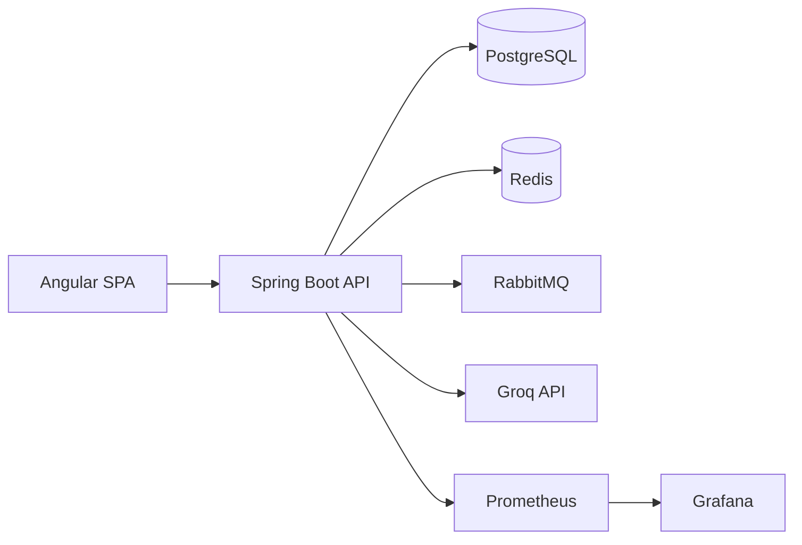

# Architecture overview

## System context

ProcureFlow is a B2B SaaS: many tenant companies share one deployment.
Clients are an Angular SPA (human users) and, later, machine integrations
over the same versioned REST API. The backend is a modular monolith; the
database is a single PostgreSQL cluster with tenant-scoped rows.

Rendered source of truth: `docs/diagrams/architecture.mmd`.

## Principles

1. **Domains over layers.** Code is organized by business capability
   (identity, procurement, approval...), each owning its domain,
   use cases, adapters and controllers. See `modular-monolith.md`.
2. **Tenant isolation is a design constraint, not a feature.** Every
   tenant-scoped query carries the tenant; cross-tenant access is a
   security bug. See `multi-tenancy.md`.
3. **API-first.** The OpenAPI document (served at `/v3/api-docs`) is the
   contract; frontend types are generated from it starting Phase 3.
4. **Async by events.** Modules communicate across boundaries via domain
   events (`shared.kernel.DomainEvent`), in-process now, RabbitMQ later.
   No synchronous calls from one module's API layer into another module.
5. **AI behind a port.** Business logic never imports a provider SDK;
   the `ai` module owns prompts, validation and metering. See ADR-005.
6. **No fake production.** Placeholders are labeled as such and fail fast;
   nothing pretends to work.

## Request lifecycle (target, Phase 2+)

Browser (JWT) → API → tenant filter sets `TenantContext` → controller calls
application use case → JPA transaction (row locks where money moves) →
domain events published → notification/audit/analytics react async.

## What exists in Phase 1

Module packages with ownership docs, core identity/organization entities,
Flyway V1 schema, `AiProvider` port, `TenantContext`, ArchUnit gates,
compose stack, CI skeletons, ADRs. Everything else is planned and tracked
in `docs/project-management/`.
